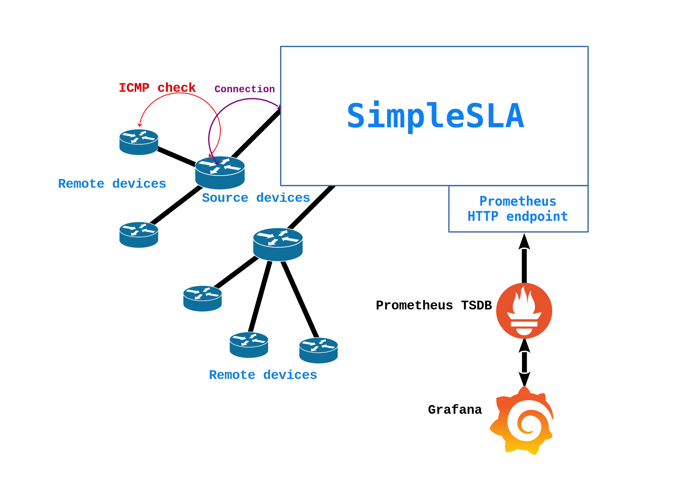

# How it works

SimpleSLA can handle ICMP checks and provide them to Prometheus with HTTP exporter. There are two ways to collect metrics: 
* Local device
* Remote device

## Local device
SimpleSLA creates local device by default and without any need to define it through config file. Local device has default name **`simplesla-local`** and that\`s the ability to ping with ICMP packets right from the server or local PC with deployed SimpleSLA

Configuration of `simplesla-local` are described [here](configuration/index.md#local)

## Remote device
SimpleSLA can connect to other devices and collect RTT to some destinations, that cannot be reachable right from SimpleSLA.

These some steps of check algorithm:
1. Connect to device
2. Send `ping` command in appropriate format
3. Recieve raw output
4. Parse raw output to some value
5. Push the value as a metric in `Metric collector`